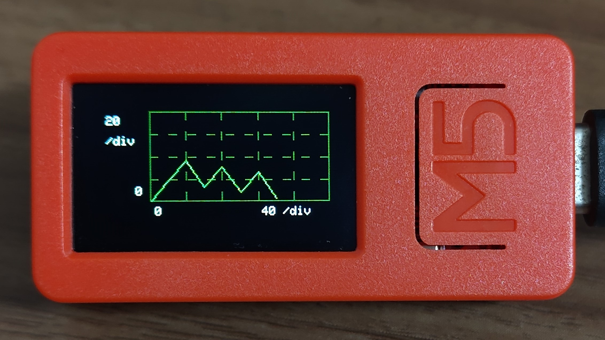

# M5Waveform
M5Stack用波形表示ライブラリです。  
※開発中

# 機能
このライブラリでは、以下の機能を提供しています

## リアルタイム波形表示(M5Waveformクラス)
### 動作概要
利用側からエンキューされたデータを逐次グラフ上に描画する。  
エンキューされたタイミングでタイムスタンプを付与し、設定されたX/Y軸範囲に基づき描画位置を決定する。  
画面右端に到達するまでは左から順番に描画し、右端に到達したら過去の描画点は左側にスクロールする。  

#### 描画方式
- マーカーのみ
- 線のみ
- マーカーと線

## オフライン波形表示(M5Plotクラス)
### 動作概要
利用側から与えられたpoint_f配列(x,yの値を保持する構造体配列)をグラフ上に描画する。  
設定されたX/Y軸範囲に基づき描画位置を決定する。  

#### 描画方式
- マーカーのみ
- 線のみ
- マーカーと線

## X/Y軸範囲の設定(M5Waveform, M5Plot共通)
- X軸1目盛りあたりの値
- X軸オフセット
- Y軸1目盛りあたりの値
- Y軸オフセット
